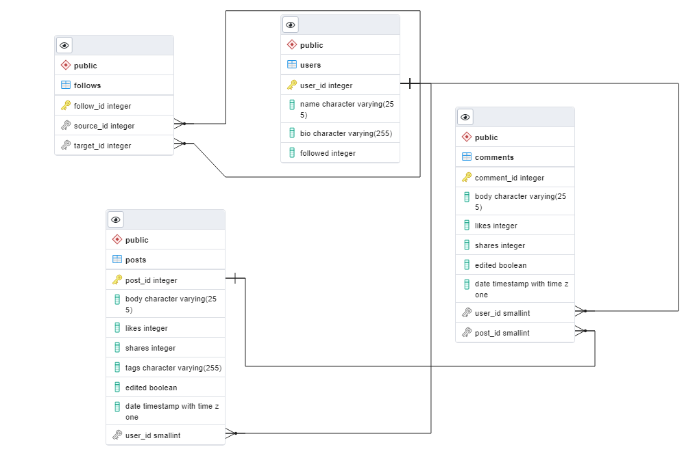

# wisper-api
Welcome to the backend repository for the Wisper app. The frontend repository can be found [here.](https://github.com/AnthonyConnell/wisper-frontend)
### Table of Contents
* [Installation](#installation)
* [Database](#database)
* [API](#api)

## Installation
##### [Top :arrow_up_small:](#table-of-contents)

## Database
##### [Top :arrow_up_small:](#table-of-contents)

This API makes use of [PostgreSQL](https://www.postgresql.org/). Currently there are 4 tables:

`users, posts, comments, follows`

All of the tables are dependent on the User table - every post has a user, every comment has a post and a user, and every user can follow any other user.

Below is the documentation for each table. You can expand each dropdown to find a short summary of the data structure, and nested inside are more detailed instructions and examples.

### Users

### Summary
The Users table holds basic information about the user, such as the name and bio. Each user has posts, comments, and follows, and those are contained in associated tables.

### Columns
Column		| Data type		| Nullable? | Description
---			| ---			| --- 		| ---
user_id		| integer		| false 	| The user's primary key
name		| string		| false		| The user's username
bio			| string		| true 		| The user's bio
followed	| integer		| true		| How many users are following this user

### Associations
Table 	| Foreign key	| Relationship
--- 	| --- 			| ---
posts	| user_id		| Has many
comments| user_id		| Has many
follows	| source_id		| Belongs to many

### Requests
See [API/User](#user) for information on requests.

### Posts

### Summary
The Post table contains information about the post, such as the body of the post, as well as likes and shares. Every post belongs to the user who posted it, and it can have many comments.

### Columns
Column	| Data type	| Nullable?	| Description
---		| ---		| --- 		| ---
post_id	| integer	| false		| The post's primary key
body	| string	| false		| The text body of the post
likes	| integer	| false		| The amount of likes the post has
shares	| integer	| false		| The amount of shares the post has
tags	| string	| true		| The tags on the post
edited	| bool		| false		| Whether or not the post has been edited
date	| date		| false		| The time the post was created
user_id	| integer	| false		| The profile ID of the user who posted it

### Associations
Table 	| Foreign key	| Relationship
--- 	| --- 			| ---
user	| user_id		| Belongs to
comments| post_id		| Has many

### Comments

### Summary
The Comments table is very similar to the Post table: It has almost identical columns, the exceptions being the lack of tags and the addition of post_id. Each comment belongs to the user who posted it, and the post it was posted on.

### Columns
Column		| Data type	| Nullable?	| Description
---			| ---		| ---		| ---
comment_id	| integer	| false		| The comment's primary key
body		| string	| false		| The text body of the comment
likes		| integer	| false		| The amount of likes the comment has
shares		| integer	| false		| The amount of shares the comment has
edited		| bool		| false		| Whether or not the comment has been edited
date		| date		| false		| The time the comment was created
user_id		| integer	| false		| The profile ID of the user who posted it
post_id		| integer	| false 	| The ID of the post being commented on

### Associations
Table 	| Foreign key	| Relationship
--- 	| --- 			| ---
user	| user_id		| Belongs to
posts	| user_id		| Belongs to

### Follows

### Summary
The Follows table is a junction table, which tracks which users each user is following. Each line in this table indicates a single one-way follow; The `source_id` is the id of the user who is following the target, and the `target_id` is the id of the user who is being followed.

### Columns

Column		| Data type		| Description
---			| ---			| ---
follow_id	| integer		| The id of this entry
source_id	| integer		| The id of the source user
target_id	| integer		| The id of the target user

### Associations
The Follows table has no associations of its own, as it is a junction table. The Users table associates with itself through this table.

 

## API
##### [Top :arrow_up_small:](#table-of-contents)

To access the databases, you can simply fetch from the app's url:

	https://wisper-api-71822.herokuapp.com/

In response, the app will return data in JSON format:

	{
		"user_id": 1,
		"name": "username",
		"bio": "Sartorial humblebrag normcore, est occaecat adaptogen mixtape distillery pabst hexagon typewriter dolore. Chillwave mustache venmo edison bulb, actually hot chicken ugh in in velit kogi aute.",
		"followed": 49
	}

### Routes
Method	| Path					| Purpose
---		| --- 					| ---
GET 	| /						| Landing page
GET		| /user/:id?{options}	| Get specific user
PUT		| /user/:id				| Update user profile
DELETE	| /user/:id				| Delete user profile
GET		| /post/:id?{options}	| Get specific post
POST	| /post					| Create new post
PUT		| /post/:id				| Update post
DELETE	| /post/:id				| Delete post
GET		| /comment/:id			| Get specific comment
POST	| /comment 				| Create comment
PUT		| /comment/:id			| Edit comment
DELETE	| /comment/:id			| Delete comment
GET		| *						| 404 page

### Simple Example
Here's an example of a fetch request and its response:

	// Request
	const fetchData = async () => { 
		var postResponse = await fetch("https://wisper-api-71822.herokuapp.com/post/1");
		const postJson = await userPostsRes.json();
		console.log(postJson)
	}

 

	// Reponse
	{
		"post_id": 1,
		"body": "Im baby labore semiotics cronut lomo intelligentsia tattooed esse tbh meh shabby chic. Taiyaki post-ironic XOXO flexitarian raclette try-hard. Pop-up artisan helvetica schlitz vaporware pitchfork freegan cronut.",
		"likes": 456,
		"shares": 76,
		"tags": "16",
		"edited": false,
		"date": "2022-07-23T15:31:39.538Z",
		"user_id": 2
	}

### Detailed Examples

Below is detailed information about using the database, including requests for getting, setting, and deleting data, as well as options for including associated tables.

### User

### Requests

<!-- GET SECTION -->

GET

Request structure:

	GET https://wisper-api-71822.herokuapp.com/user/{id}?{options}

Parameters:

`id:` The id of the user to fetch from

`options:` Options to choose what data to include in the response

Options:

`withPosts=true:` Include the user's posts

`withComments=true:` Include the user's comments

`withFollows=true:` Include the user's follows

 
Response structure:

	{
		"user_id": integer,
		"name": string,
		"bio": string,
		"followed": integer,
		// optional includes
		"posts": object array,
		"follows": object array,
		"comments": object array
	}	

### Examples
1: Get user data

	// Request
	const fetchData = async () => { 
		var postResponse = await fetch("https://wisper-api-71822.herokuapp.com/post/1");
		const postJson = await userPostsRes.json();
		console.log(postJson)
	}

 

	// Reponse
	{
		"post_id": 1,
		"body": "Im baby labore semiotics cronut lomo intelligentsia tattooed esse tbh meh shabby chic. Taiyaki post-ironic XOXO flexitarian raclette try-hard. Pop-up artisan helvetica schlitz vaporware pitchfork freegan cronut.",
		"likes": 456,
		"shares": 76,
		"tags": "16",
		"edited": false,
		"date": "2022-07-23T15:31:39.538Z",
		"user_id": 2
	}

2: Get user data with posts, comments, and follows

		// Request
	const fetchData = async () => { 
		var postResponse = await fetch("https://wisper-api-71822.herokuapp.com/user/2?withPosts=true&withComments=true&withFollows=true");
		const postJson = await userPostsRes.json();
		console.log(postJson)
	}

 

	// Reponse
	{
		"user_id": 2,
		"name": "pokemon",
		"bio": "3 wolf moon occupy lo-fi pop-up 90's pug raclette, try-hard kogi kickstarter tilde shabby chic fingerstache gochujang dreamcatcher",
		"followed": 132,
		"posts": [
		{
			"post_id": 1,
			"body": "Im baby labore semiotics cronut lomo intelligentsia tattooed esse tbh meh shabby chic. Taiyaki post-ironic XOXO flexitarian raclette try-hard. Pop-up artisan helvetica schlitz vaporware pitchfork freegan cronut.",
			"likes": 456,
			"shares": 76,
			"tags": "16",
			"edited": false,
			"date": "2022-07-23T15:31:39.538Z",
			"user_id": 2
		}
	],
	"follows": [
		{
			"user_id": 1,
			"name": "username",
			"bio": "Sartorial humblebrag normcore, est occaecat adaptogen mixtape distillery pabst hexagon typewriter dolore. Chillwave mustache venmo edison bulb, actually hot chicken ugh in in velit kogi aute.",
			"followed": 894
		}
	],
	"comments": []
	}

<!-- PUT SECTION -->

PUT

Request structure:

	PUT https://wisper-api-71822.herokuapp.com/user/{id}

Parameters:

`id:` The id of the user to update

 
Response structure:

	{
		message: "Successfully updated user {id}"
		updatedUser: {
			"user_id": integer,
			"name": string,
			"bio": string,
			"followed": integer
		}
	}	

### Example
1: Update username

	// Request
	let response = await fetch(`https://wisper-api-71822.herokuapp.com/user/3`, {
		method: 'PUT',
		headers: {
			'Content-Type': 'application/json'
		}, 
		body: JSON.stringify({
			name: "Werefox22"
		})
	})
	responseJson = response.json()
	console.log(responseJson)

 

	// Reponse
	
	{
		message: "Successfully updated user 3"
		updatedUser: {
			"user_id": 3,
			"name": "Werefox22",
			"bio": "Lorem ipsum",
			"followed": "7"
		}
	}	

2: Update entire user

	// Request
	let response = await fetch(`https://wisper-api-71822.herokuapp.com/user/4`, {
		method: 'PUT',
		headers: {
			'Content-Type': 'application/json'
		}, 
		body: JSON.stringify({
			// note that user_id is excluded here as it's the primary key and cannot be changed
			"name": "Typerfish",
			"bio": string,
			"followed": integer
		})
	})
	responseJson = response.json()
	console.log(responseJson)

 

	// Reponse
	{
		"user_id": 2,
		"name": "pokemon",
		"bio": "3 wolf moon occupy lo-fi pop-up 90's pug raclette, try-hard kogi kickstarter tilde shabby chic fingerstache gochujang dreamcatcher",
		"followed": 132,
		"posts": [
		{
			"post_id": 1,
			"body": "Im baby labore semiotics cronut lomo intelligentsia tattooed esse tbh meh shabby chic. Taiyaki post-ironic XOXO flexitarian raclette try-hard. Pop-up artisan helvetica schlitz vaporware pitchfork freegan cronut.",
			"likes": 456,
			"shares": 76,
			"tags": "16",
			"edited": false,
			"date": "2022-07-23T15:31:39.538Z",
			"user_id": 2
		}
	],
	"follows": [
		{
			"user_id": 1,
			"name": "username",
			"bio": "Sartorial humblebrag normcore, est occaecat adaptogen mixtape distillery pabst hexagon typewriter dolore. Chillwave mustache venmo edison bulb, actually hot chicken ugh in in velit kogi aute.",
			"followed": 894
		}
	],
	"comments": []
	}

DELETE

